# atari breakout game
> `breakout` `Reinforcement Learning` `DQN` `pytorch`

利用pytorch實作DQN在atari的breakout遊戲。

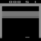

# Environment
## 1.套件安裝
- ``!pip install atari-py==0.2.6``
- ``!pip install gymnasium==0.26.0``
- ``!pip install gymnasium[atari]``

# Introduction
## 1.遊戲簡介

類似乒乓球的遊戲，玩家在遊戲中擁有五條生命，遊戲過程中須控制球拍擊球，將球反彈至上方擊打磚塊獲得積分，擊打到越上層的磚塊可以獲得越高的分數。若玩家未成功將球反彈而使其觸碰畫面下方邊界，則會失去一條生命，目標是盡可能獲得高分。

## 2.game information
- action: ['NOOP', 'FIRE', 'RIGHT', 'LEFT']
- observation space: Box(0, 255, (210, 160, 3), uint8)
- import: evn=gym.make("ALE/Breakout-v5")

## 3.RL運作原理
```python
for episode in range(Max_step):
  state=env.reset() #初始化
  while True:
    action=self.choose_action(state) #RL演算法
    state_next,reward,ter,tru,info=env.step(action)
    #ter->terminated 遊戲成功或失敗，tru->truncated 是否超過遊戲限制(ex:超時、超步數)
    #info->除了state以外的其他資訊

    self.store_transition(state, action, reward, state_next, ter) #儲存狀態
    if total_step > 4*self.batch_size: #蒐集一定步數後才開始訓練
        loss = agent.learn()
    state=state_next.copy() #更新狀態

    if ter or tru: #如果遊戲結束
      break
```

# Implementation
## 1.Wrapper
- gymnasium.Wrapper
  - env.reset():初始化
  - env.step(action):選擇一個動作，環境回傳**state_next,reward,ter,tru,info**
- 遊戲畫面預處理
  - Resize(調整大小):(84,84)
  - Grayscale Conversion(灰階轉換):將RGB值除以255轉灰階
  - Frame Stacking(幀疊加):一次疊加4幀畫面

## 2.Qnet
1. 三個卷積層：每個卷積層使用不同的kernel_size和stride，並且後面都接著ReLU激活函數。
(input_channels,out_channels,kernel_size,stride)分別為(4,32,8,4)、(32,64,4,2)、(64,64,3,1)。
2. 兩個全連接層：第一個全連接層的輸入大小由卷積層的輸出大小計算得到，為conv_out_size；輸出大小為512。第二個全連接層的輸入大小為512，輸出大小為n_actions。


## 3.DQN

### introduction  
- 一種強化學習演算法，應用於解決馬爾可夫決策過程（Markov Decision Process, MDP）問題
- 用神經網路模擬Q函數，衡量在狀態下採取某動作的價值
- 使用Q-learning更新神經網，透過Q值最大化，反映不同狀態中的最佳動作，以獲得更高的獎勵。

### implementation
- 神經網路
  |網路|用途|更新頻率|原理|
  |--|--|--|--|
  |q_eval|計算當前動作的Q值、選擇最佳動作|每次learn|最佳化Q函數|
  |q_target|計算目標Q值|以replace_target_iter的頻率更新成q_eval|緩慢更新以減少訓練不穩定性|
- experience replay:儲存過往訓練資料，並隨機抽樣訓練
  
  $Q_{target} ​(s,a)=r + (1−done) \cdot γ \cdot max_{a′}\ Q_{target}​​(s′,a′)$
  
  deep Q-learning with experience replay

  q-vaule qnet_target

## 4.main loop

# Hyperparameters
- learning_rate = 2e-4
- reward_decay = 0.99
- replace_target_iter = 5000 steps (更新 qnet_target網路的頻率)
- memory_size = 100000 (回放資料大小)
- batch_size = 32

## e-greedy exploration
```python
epsilon_min + (epsilon_max - epsilon_min) * np.exp(-frame_id / epsilon_decay)
```
- epsilon_max: 1.0
- epsilon_min: 0.05
- epsilon_decay: 400000
```
exploration -> 探索 -> 隨機採取random action、但有可能無法收斂
exploitation -> 開發 -> 收斂到best action、但有可能就只收斂到local minimum
```


# Experiments
## 31601
|改變參數|數值|
|--|--|
|memory_size|50000|
|replace_target_iter|1000|

- 訓練次數:8000000
- max_scroe:41

|average td-loss(100 steps)|score(each episode)|average score(100 episodes)|
|--|--|--|
|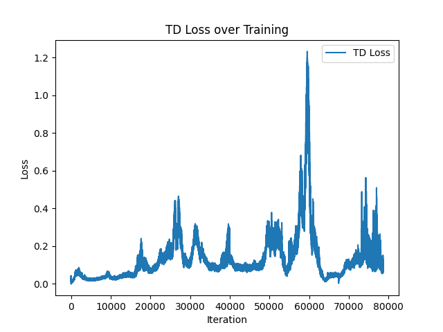|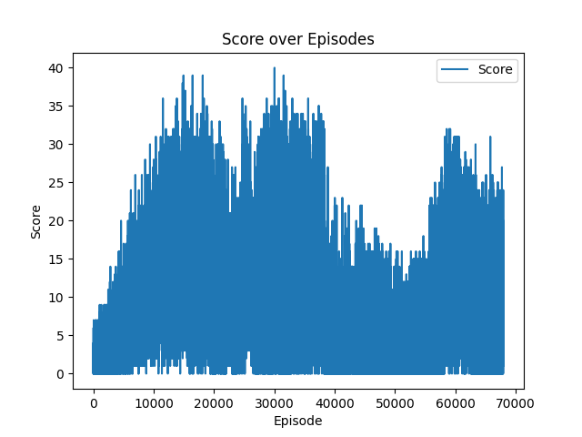|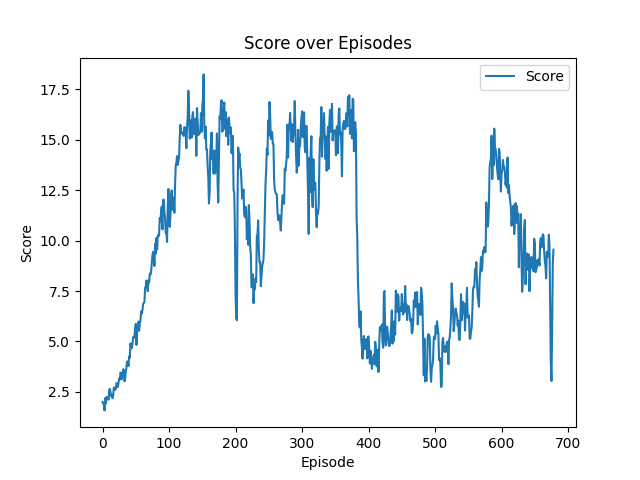|

## 33101
與Hyperparameters所列之參數相同

- 訓練次數:8250000
- max_scroe:57

|average td-loss(100 steps)|score(each episode)|average score(100 episodes)|
|--|--|--|
|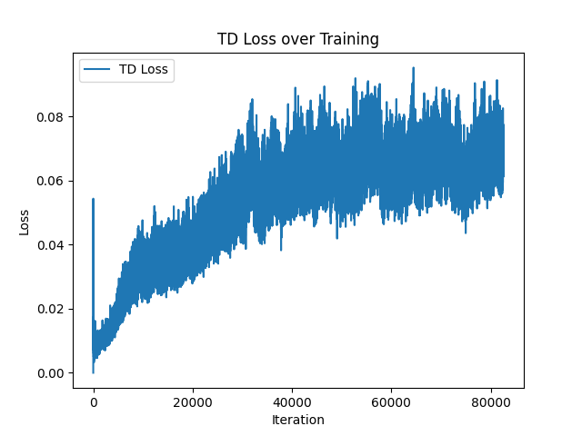|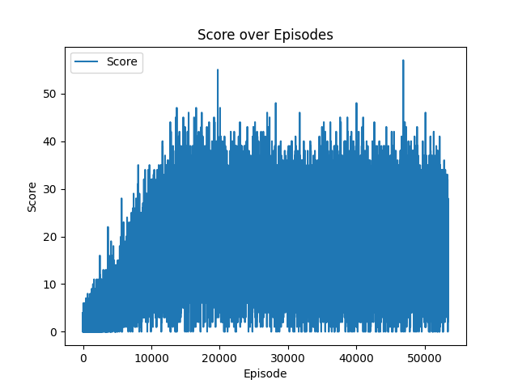|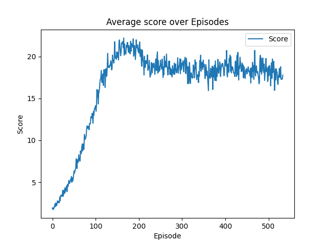|


## 40301
|改變參數|數值|
|--|--|
|memory_size|200000|

- 訓練次數:7000000
- max_score:47

|average td-loss(100 steps)|score(each episode)|average score(100 episodes)|
|--|--|--|
|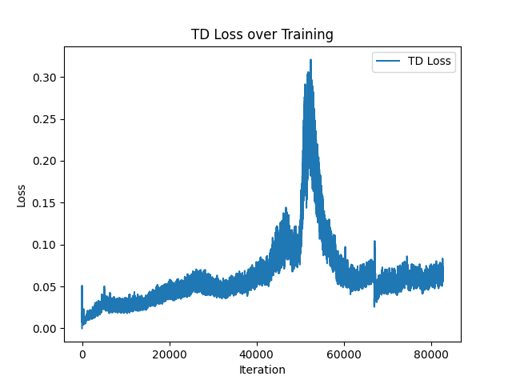|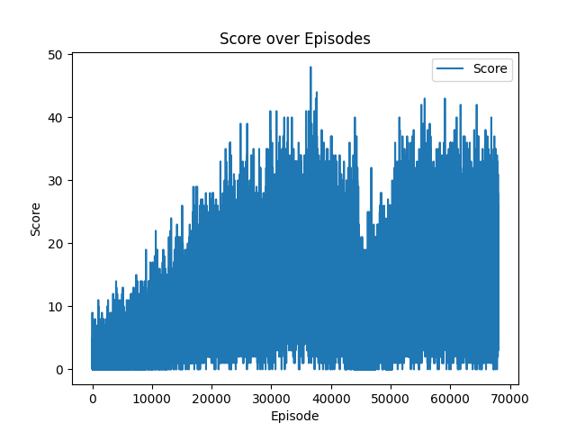|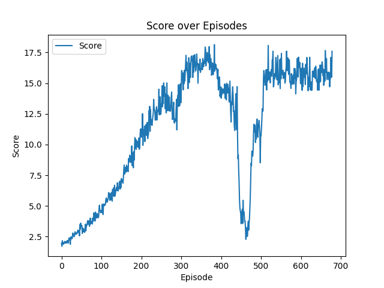|

## 40701
|改變條件|方法|
|--|--|
|失命reward扣分|-=上次得分(>0)|

- 訓練次數:8000000
- max_score:41

|average td-loss(100 steps)|score(each episode)|average score(100 episodes)|
|--|--|--|
|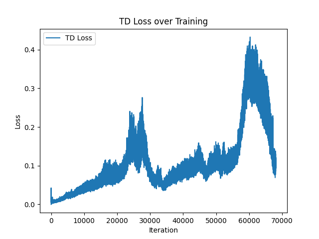|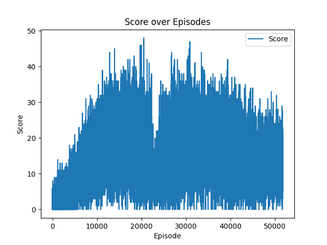|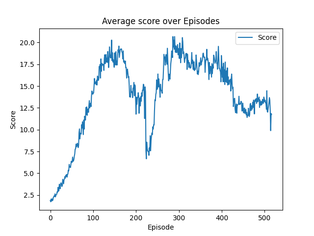|


## 42301
|改變條件|方法|
|--|--|
|神經網路更新頻率|total_step%4==0|

- 訓練次數:5500000
- max_scroe:80

|average td-loss(100 steps)|score(each episode)|average score(100 episodes)|
|--|--|--|
|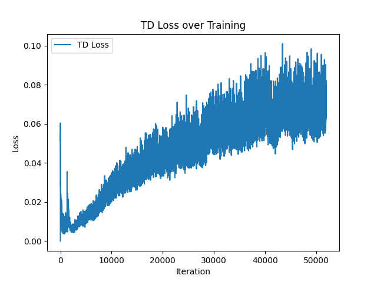|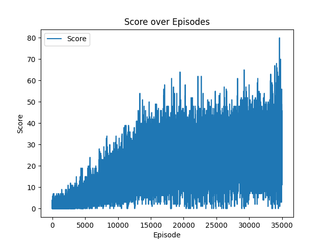|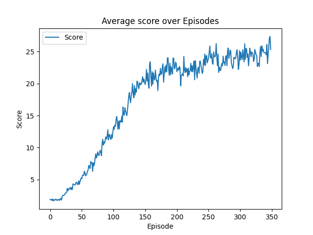|

## 50401
|改變條件|方法|
|--|--|
|神經網路更新頻率|total_step%6==0|

- 訓練次數:5500000
- max_scroe:81

|average td-loss(100 steps)|score(each episode)|average score(100 episodes)|
|--|--|--|
||||

## 50801
|改變條件|方法|
|--|--|
|神經網路更新頻率|total_step%4==0|
|失命reward扣分|-=上次得分(>0)|

- 訓練次數:5500000
- max_scroe:174

|average td-loss(100 steps)|score(each episode)|average score(100 episodes)|
|--|--|--|
||||


# Referance
- "Playing atari with deep reinforcement learning". Mnih, Volodymyr, Kavukcuoglu, Koray, Silver, David, Graves, Alex, Antonoglou, Ioannis, Wierstra, Daan, and Riedmiller, Martin. In NIPS Deep Learning Workshop. 2013. [Link](https://arxiv.org/abs/1312.5602)
- [breakout-Deep-Q-Network](https://github.com/yyc0314/breakout-Deep-Q-Network)
- [DQN-Atari-Breakout](https://github.com/yyc0314/DQN-Atari-Breakout)
